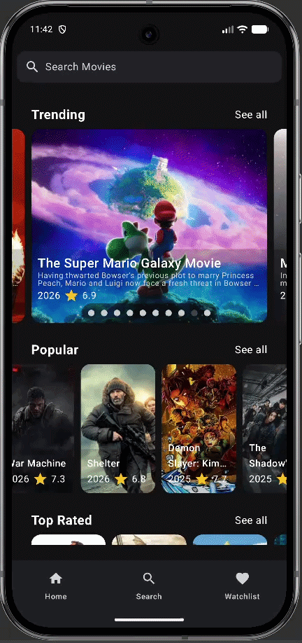
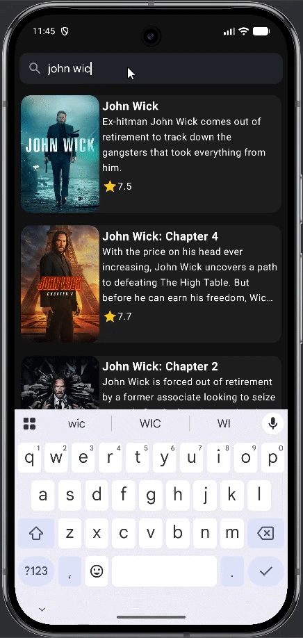

Demo Movie App demonstrating best practices in modern Android development. Implements Clean Architecture with a modular structure, Jetpack Compose UI, Kotlin Coroutines, and Flows. Integrates with a remote API via Retrofit and leverages Room for efficient local caching and offline support.

  
  

  
  

